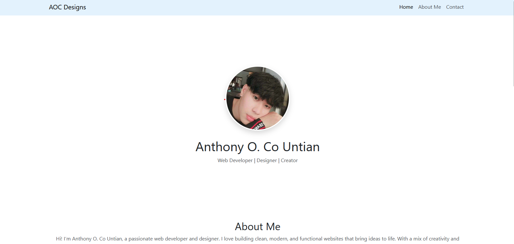

---

## 📌 Features

- ✅ **Responsive Design**: Built with Bootstrap 5 for full mobile responsiveness.
- ✅ **Clean Layout**: Sections for Home, About Me, Portfolio, and Contact.
- ✅ **Image Cards**: Project thumbnails presented in Bootstrap cards.
- ✅ **Interactive Contact Form**: Simple contact form (non-functional by default).
- ✅ **Social Links**: Facebook, GitHub, and Email icons in the footer.
- ✅ **Custom CSS**: Smooth hover effects and personalized styling with `styles.css`.

---

## 🛠️ Tech Stack

- **HTML5**
- **CSS3** (+ Bootstrap 5)
- **PHP** (for templating; not yet dynamic)
- **Bootstrap Icons**

---

## 📸 Screenshots

---

## 📬 Contact

If you'd like to get in touch:

- 📧 Email: [countian3@gmail.com](mailto:countian3@gmail.com)
- 🌐 GitHub: [github.com/Co3code](https://github.com/Co3code)
- 📘 Facebook: [Cy Yan](https://facebook.com)

---

## 📄 License

This project is open source and free to use under the [MIT License](LICENSE).

---

## 🙌 Credits

Developed by **Anthony O. Co Untian**  
Design inspired by clean UI/UX principles and Bootstrap’s grid system.
